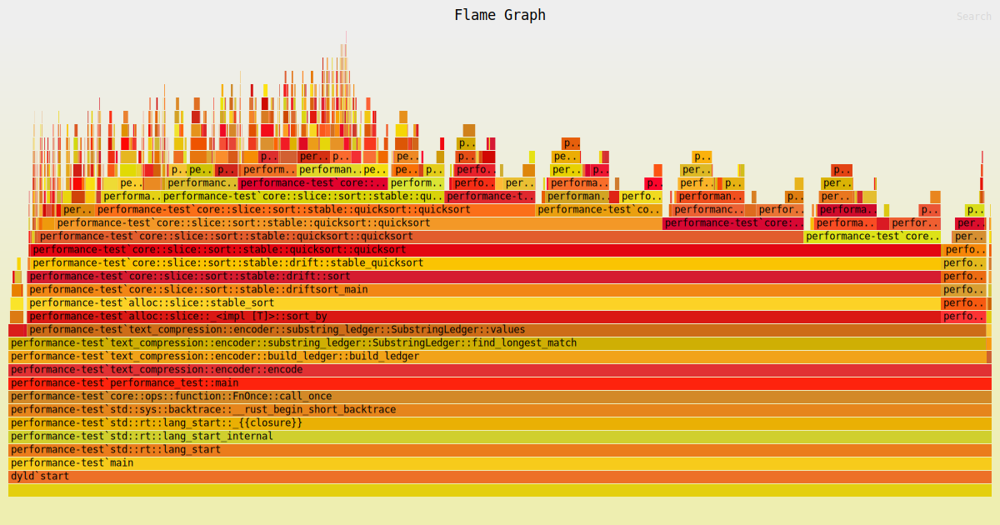

# Finding the bottleneck

To analyze where my program is spending most of its time, I'm going to need a profiler to collect the execution data. It seems that there are a few options existing for Rust, notably:

- [flamegraphs](https://github.com/flamegraph-rs/flamegraph)
- [cargo-instruments](https://crates.io/crates/cargo-instruments)
- [valgrind](https://valgrind.org/)

The tool that pops out for me immediately is `flamegraphs`. I used flamegraphs as a visualization tool before in other projects, so that was is my natural first choice. It looks like the latter two tools offer a lot more functionality, e.g. profiling the memory allocations, but they require use of external tools (namely, Apple's Instruments or Valgrind). At the moment they look like an overkill for the task at hand. So, I'm proceeding with `flamegraphs`.

## Generating the flamegraph

The installation and usage instructions are thoroughly documented in the [flamegraphs repository](https://github.com/flamegraph-rs/flamegraph). Having it installed, I ran the following command to generate the `flamegraph.svg` in the project's root directory:

```bash
cargo flamegraph --bin=performance-test --dev
```

Here's the flamegraph that was generated:



## Analyzing the flamegraph

[Flamegraphs](https://www.brendangregg.com/flamegraphs.html) were popularized by Brendan Gregg, as a tool to visualize the call stack traces. One remarkable thing I like about them is that they are very easy to interpret. Even if I don't understand a single thing about what I'm looking at, it's clear that something fishy is going on in `SubstringLedger::values()` method. That's just enough to start digging, but I'd like to spend a few minutes to describe what flamegraphs represent.

The way `cargo-flamegraph` works is that it launches the target program and starts sampling stack traces at regular intervals. On Mac OS, it uses a tool called [dtrace](https://dtrace.org/about/) to do that. The sampling process generates a ton of data points, which are then processed by merging the similar stack traces together, and generating the interactive SVG image.

On the Y-axis of the graph, we see the stack frames, bottom to top. Down below is the bottom of the call stack, i.e. the function that was called first, and the tip of each "flame" is the function that was being executed on the CPU at the moment the sample was taken.

On the X-axis, same function calls in stack traces are grouped together into boxes. The width of each box is proportional to the number of samples that contained that function call. So wide boxes represent the functions that take long time to execute, or are called more often than others.

The left-to-right order of function calls on the X-axis doesn't actually represent anything. In particular, it **doesn't show** the passing of time or the order of execution. It's just a visual grouping of function calls. Also, the color of each box isn't significant. They are chosen somewhat at random, just to make the graph more readable.

## DTrace

- DTrace
- Sidenote: Does release version run much faster than debug version? Why?
