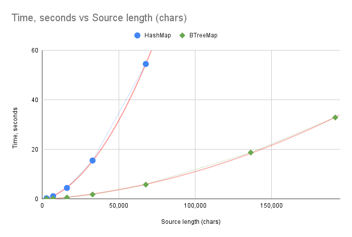
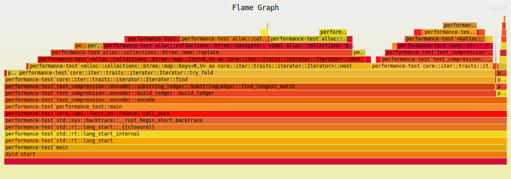

# Tackling the performance bottleneck

## Switching to BTreeMap

## Custom sorting order: Ord trait

## Ord and PartialOrd: which algorithms need which?

Looks like PartialOrd is needed for sorting.

## Running

## The results after the change

Here's the results of running the main program after the change:

| File Name       | Source Length (chars) | Compression Ratio | Time (s) | Top 5 Substrings                                                                                                                                                                                                                                                                                                                                                                                                             |
| --------------- | --------------------: | ----------------: | -------: | ---------------------------------------------------------------------------------------------------------------------------------------------------------------------------------------------------------------------------------------------------------------------------------------------------------------------------------------------------------------------------------------------------------------------------- |
| hamlet-100.txt  |                 2,763 |            41.40% |     0.05 | `["                 E", "?\n  Fran. Bernardo", "                ", ".\n  Mar. Horatio", "n, courtier.\n  A"]`                                                                                                                                                                                                                                                                                                                |
| hamlet-200.txt  |                 7,103 |            33.31% |     0.16 | `["                                 E", "\n                    ", "                    ", "it, Horatio.\n  Hor. ", "\n\n                "]`                                                                                                                                                                                                                                                                                  |
| hamlet-400.txt  |                16,122 |            32.17% |     0.55 | `["                                            ", "                                        ", "                                 Exit ", "                                 E", ".\n                                "]`                                                                                                                                                                                                        |
| hamlet-800.txt  |                32,894 |            30.04% |     1.77 | `["                                            ", ", my lord.\n                                ", "                                        E", "                                        ", "ewell.\n                                "]`                                                                                                                                                                                      |
| hamlet-1600.txt |                67,730 |            28.67% |     5.75 | `[".\n                                                         ", "                                                     Exe", "                                                      ", " him.\n                                                ", ".\n                                                   "]`                                                                                                                |
| hamlet-3200.txt |               136,410 |            28.79% |    18.73 | `[".\n                                                         Exeunt.\n\n\n\n\n", ".\n                                                         Exeunt.\n\n", "love.\n                                                         ", ".\n                                                         ", "                                                     Exe"]`                                                               |
| hamlet.txt      |               191,725 |            28.97% |    32.88 | `[".\n                                                         Exeunt.\n\n\n\n\nScene II.\nElsinore. A", "follow.\n                                                         Exeunt.\n\n\n\n\n", ".\n                                                         Exeunt.\n\n\n\n\n", ".\n                                                         Exeunt.\n\n", ".\n                                                         "]` |

Clearly, the performance has become much better: encoding 1600 lines of "Hamlet" takes 5.75 seconds, versus 54.51 seconds from the [previous results](TODO: Link to first iteration). However, the increase in execution time as the text length increases is still puzzling me.

Since the execution time has fallen dramatically, I can now run the performance test on the entire text of "Hamlet". Here's how the flamegraph looks:

`SubstringLedger::find_longest_match()` is still the bottleneck, but the situation has changed. I got rid of the excessive sorting, and now most of the time is spent in trying to find the matching substring in the map.

When trying to find the match, we iterate over all keys in the map. It's clear that, since currently the size of the substring dictionary is not limited, the time to go through all keys is going to grow linearly with the dictionary size. On top of that, at each step we check if the current substring matches the start of the text. That in itself is a linear operation, and it will take more and more time, as we accumulate progressively longer substrings in the dictionary. I think that explains the polynomial growth of the execution time.

For now I can see two ways to further improve the performance:

- Try to get rid of scanning all the keys in the map, or
- Move to the next stage of the project, in which the size of the dictionary will be limited during construction, which by extension will reduce the time spent in `SubstringLedger::find_longest_match()`.

## Next step
