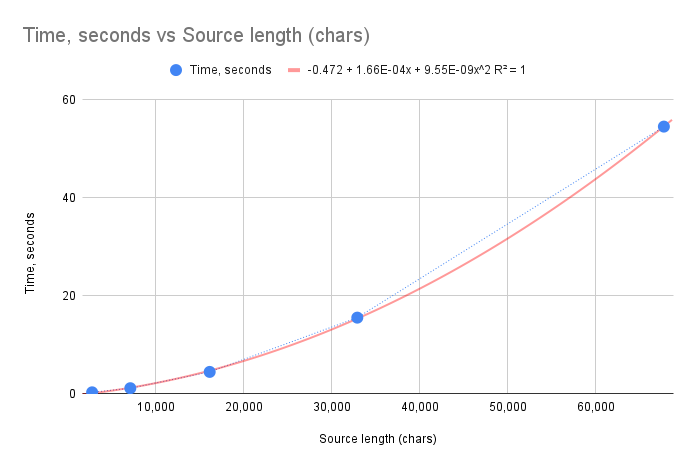

# First iteration

- Focus on building the end-to-end solution;
- Simplify the algorithm.
- Lessons learned in Rust:
  - HashMap;
  - Strings

# The first iteration: Make It Work

At the heart of the text compression is the algorithm that builds the dictionary of most frequent substrings. The original algorithm, as described in [1], focuses a lot on keeping the dictionary size limited. It does so by applying strategies for adding new substrings, and removing the least frequent ones when the size limit is reached. There's a lot of room for experimentation here.

For the first iteration, I've decided to build a simpler version of the dictionary construction algorithm. My goal is to focus more on the end-to-end solution, which includes the following steps:

1. Build the dictionary of most frequent substrings.
2. Encode the text using the dictionary.
3. Decode the text back to the original form.

In particular, I assume that the dictionary is not limited in size during the construction. I'm going add as many substrings as I want, and not care about pruning. Once the dictionary is built, I'll select the first N substrings that give the best compression gain. Also, I'm going to build the encoder that would compress UTF-8 encoded strings, and the decoder to do the reverse.

At this stage, I'm also not concerned about the performance. I'm just going to build the simplest possible solution that would work, and then I'll start optimizing.

Finally, I'm not bothered about a proper error handling. Rust has a special way of handling errors using the `Result` type, but for the time being I'm ok with just panicking at runtime if anything goes wrong. I'll make a note of the places where proper error handling should be implemented, and will come back to it later.

## Encoding scheme

My program works with UTF-8 encoded strings, which are natural in Rust. The question is how to embed the substring replacements into the encoded text, so that we don't confuse them with uncompressed portions.

The answer here is to use a special marker byte to indicate the replacement. The marker byte should be a value that would never occur in the original text, so that we don't mistake it for an uncompressed portion at the decoding stage.

As per the [UTF-8 specification](https://en.wikipedia.org/wiki/UTF-8), there are bytes that could never appear in a valid UTF-8 string. In particular, bytes 0xF5-0xFF are invalid. I chose to use 0xF5 as a marker, and the substring replacement will be a 2-byte sequence of a form `0xF5 0xNN`, where `NN` is the index of the substring in the dictionary. That would limit the total number of representable substrings to 256, which should be enough for starters.

As a slight future improvement, I could expand the size of the dictionary beyond 256, still using 2 bytes for the representation. Since the entire range 0xF5-0xFF is not represented in the UTF-8, I can use the portion of the marker byte as a part of the index. That would allow me to increase the dictionary size to 11 \* 256 = 2816 substrings. I might consider it later, when I start playing with optimizations.

## Selecting the most impactful substrings

TODO

## Trying out the first version

Once I have the the first version end-to-end working, let's go on an try it out on a few samples.

What I'm interested in is:

- Does it do encoding and decoding correctly (obviously);
- The compression ratio;
- Most common substrings found in the text;
- Time performance compressing texts of different lengths.

To keep things simple, I just grabbed Shakespeare's "Hamlet" from the Web, and created a few samples from it, taking first 100, 200, 400, and 800 lines from the text. I wrote a simple `main` program to perform the encoding / decoding round on each, and record the data that interests me.

Here's the results we get after running this program:

| File Name       | Source Length (chars) | Compression Ratio | Time (seconds) | Top 5 Substrings                                                                                                                                                                                                                                                                                              |
| --------------- | --------------------: | ----------------: | -------------: | ------------------------------------------------------------------------------------------------------------------------------------------------------------------------------------------------------------------------------------------------------------------------------------------------------------- |
| hamlet-100.txt  |                 2,763 |            41.40% |           0.25 | `["                 E", "?\n  Fran. Bernardo", "                ", ".\n  Mar. Horatio", "n, courtier.\n  A"]`                                                                                                                                                                                                 |
| hamlet-200.txt  |                 7,103 |            33.99% |           1.09 | `["                                 E", "\n                    ", "                    ", "it, Horatio.\n  Hor. ", "\n\n                "]`                                                                                                                                                                   |
| hamlet-400.txt  |                16,122 |            32.22% |           4.42 | `["                                            ", "                                        ", "                                 Exit ", "                                 E", ".\n                                "]`                                                                                         |
| hamlet-800.txt  |                32,894 |            30.43% |          15.50 | `["                                            ", ", my lord.\n                                ", "                                        E", "                                        ", "ewell.\n                                "]`                                                                       |
| hamlet-1600.txt |                67,730 |            28.67% |          54.51 | `[".\n                                                         ", "                                                     Exe", "                                                      ", " him.\n                                                ", ".\n                                                   "]` |

It's good to see the program working, and even giving some sensible results! I'm curious about the compression ratio, it's clear that it goes down as the text length increases. I wonder how much it would go down when the text length is increased further.

But one other thing I'm worried about is the time performance. It's clear that the running times grows rapidly as the text length increases. Let's put that data into a graph.

That absolutely looks like a quadratic curve, and the running time for 1600 lines of 54 seconds is preventing me from doing any experiments with larger texts. It's quite obvious that I need to optimize the algorithm before I can move forward.
